# Comparing Audio Transformers for Gravitational-Wave Signal Detection

This project evaluates seven state-of-the-art audio transformers for the task of detecting simulated gravitational-wave (GW) signals.
Models are fine-tuned on binary classification (signal vs. no-signal) across six mass ranges.

### Author: Suyash Deshmukh
Fall 2025, DS 5690 @ Vanderbilt 

## 1. Problem Statement & Overview
<!-- Problem is clearly stated. Proposed approach is outlined. Project is presented in an understandable fashion. -->

Gravitational-wave (GW) detectors like LIGO measure extremely weak signals embedded in complex non-stationary noise. These signals vary in morphology based on the parameters of the black holes colliding (such as masses, distance, etc.).

#### Event GW230627 - Total Mass: 14 Solar Masses
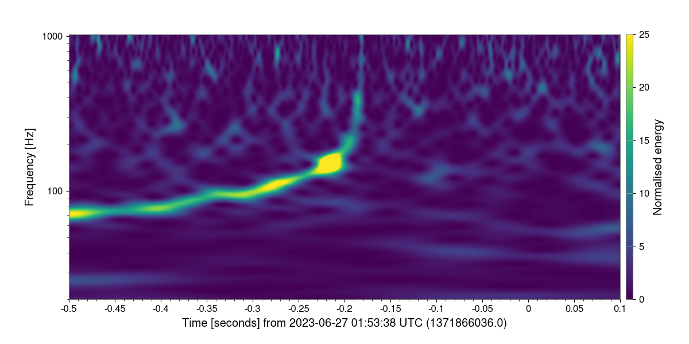

#### Event GW231226 - Total Mass: 74 Solar Masses
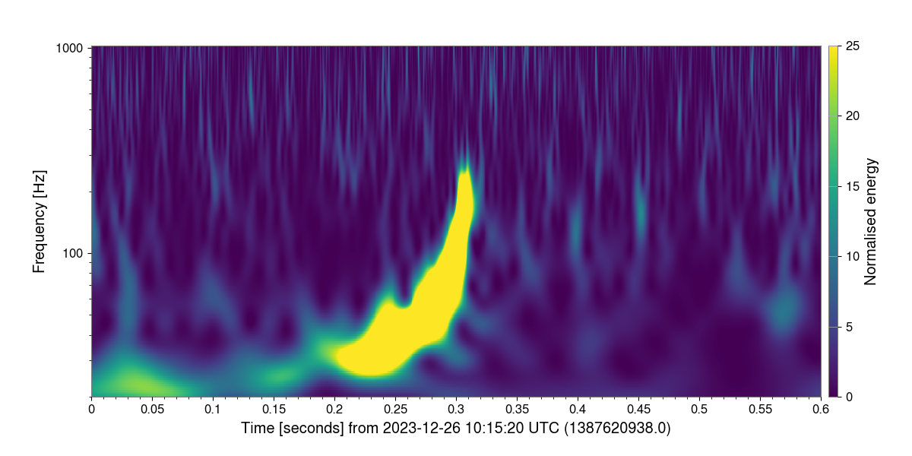

#### Event GW231028 - Total Mass: 153 Solar Masses
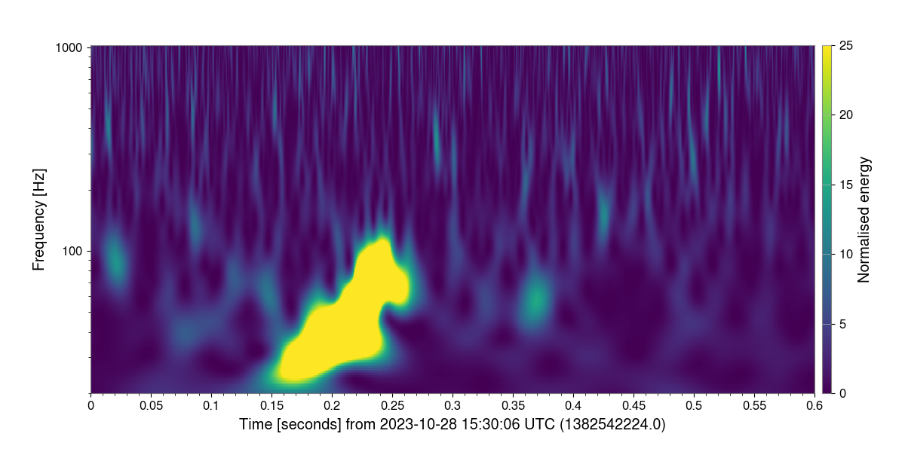

#### Event GW231123 - Total Mass: 243 Solar Masses
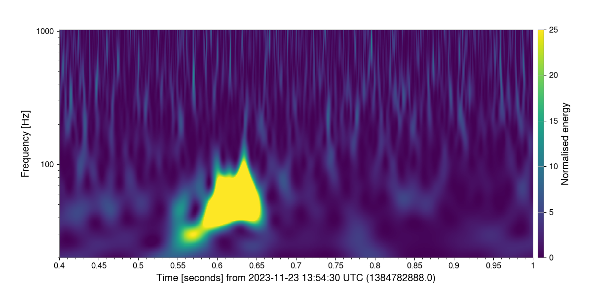

As shown in the above figures, as the total mass of a GW event increases, we detect a smaller amount of the iconic "chirp" shape. 

The first step of GW data analysis is to identify and label GW events out of the noisy strain signal outputted by LIGO. This forms the basis for a lot of the further analsysis performed by Astronomers, and so needs to be done accurately. The current method is to use matched filtering, which has millions of templates and checks each one against the incoming signal to find the best match. Not only is this very computationally expensive, it also fails the moment there is anything unexpected / not in the templates. This is a problem as LIGO detectors have a lot of noise and frequently show glitches in the data stream.

As a potential solution to this problem, we want to figure out:
- How well do leading audio transformer models detect GW signals across different mass regimes?
- Which architectures generalize best across mass ranges?

This project compares seven state-of-the-art audio transformer architectures for binary classification (signal vs no-signal) of gravitational-wave signals:

- Whisper Tiny
- Wav2Vec2
- Wav2Vec2-BERT
- Wav2Vec2-XLSR (multilingual)
- HuBERT
- Audio Spectrogram Transformer (AST)
- Mimi

### Goal: Determine which audio transformer is the best at detecting simulated GW signals across multiple mass ranges.

where "the best" = highest AUROC (Area Under ROC Curve).

## 2. Methodology
<!-- Techniques, theories, methodolgies or approaches from the course have been applied in the solution of the problem presented. A clear connection has been made to the content. -->


### 2.1 Data Generation

I'm using the `ML4GW` pipeline to generate the data needed for training, validation, and evaluation. This is a standard pipeline that is frequently used in Astronomy to generate simluated GW signals. The tutorial for this pipeline can be found here: [ML4GW Tutorial](https://github.com/ML4GW/ml4gw/blob/main/docs/tutorials/ml4gw_tutorial.ipynb).

I am training the models on signals from $20 - 800 \text{ Solar Masses } (M_\odot)$; and then evaluating on the following mass ranges:

1) $20 - 60 M_\odot$
2) $60 - 120 M_\odot$
3) $120 - 200 M_\odot$
4) $200 - 400 M_\odot$
5) $400 - 600 M_\odot$
6) $600 - 800 M_\odot$

For all of the data generation the overall flow is as follows:
- Generate waveforms using one of the widly available astronomical standard approximants, sampling the parameter space chosen.
- Calculate observed strain from detector if generated waveform passed through it.
- Estimate Signal-to-Noise Ratio (SNR) and the Spectral Density to "whiten" the data (astrophysically meaningful way of normalizing the strain data). 
- Pass whitened data into models in their respective input formats.

If you simply don't inject the waveform (skip the first step), you get your control sample of "no signal".

### 2.2 Parameter Space Sampled

```py
param_dict = {
    "chirp_mass": PowerLaw(((1/4)**(3/5) * 20), ((1/4)**(3/5) * 800), -2.35),
    "mass_ratio": DeltaFunction(1),
    "chi1": DeltaFunction(0),
    "chi2": DeltaFunction(0),
    "distance": PowerLaw(100, 1000, 2),
    "phic": DeltaFunction(0),
    "inclination": Sine(),
}
```

### 2.3 Connection to Class

Instead of training a model from scratch, I am fine-tuning large pretrained models. To save time and compute while fine-tuning them, I apply DoRA (Weight-Decomposed Low-Rank Adaptation), the newer evolution of LoRA.

## 3. Model Cards

### Whisper (OpenAI)
| Field                    | Description                                                               |
| ------------------------ | --------------------------------------------------------------------------- |
| **Model Name**           | openai/whisper-tiny                                                               |
| **Model Type**           | Encoder–Decoder Transformer                                                 |
| **Task**                 | Large-scale speech recognition, speech translation, and language identification |
| **Total Parameters**     | 8,312,832                                                    |
| **Trainable Parameters** | 104,448                                                    |
| **Training Time**        | ~2 hour 15 mins                                                    |

### Wav2Vec2 (Meta)
| Field                    | Description                                                                    |
| ------------------------ | ---------------------------------------------------------------------------    |
| **Model Name**           | facebook/wav2vec2-base-960h                                                                       |
| **Model Type**           | Transformer Encoder with CNN feature extractor + contrastive pretraining       |
| **Task**                 | Self-supervised speech representation learning; automatic speech recognition   |
| **Total Parameters**     | 94,998,400                                                       |
| **Trainable Parameters** | 626,688                                                       |
| **Training Time**        | ~30 mins                                                       |

### Wav2Vec2-BERT (Meta)
| Field                    | Description                                                                    |
| ------------------------ | ---------------------------------------------------------------------------    |
| **Model Name**           | facebook/w2v-bert-2.0                                                                      |
| **Model Type**           | Hybrid CNN + Transformer encoder + BERT-style embedding stack       |
| **Task**                 | Joint self-supervised audio representation learning combining Wav2Vec2’s CNN+Transformer extractor with BERT-style masked prediction   |
| **Total Parameters**     | 582,164,288                                                       |
| **Trainable Parameters** | 1,671,168                                                       |
| **Training Time**        | ~1 hour 30 mins                                                       |

### Wav2Vec2-XLSR (Meta)
| Field                    | Description                                                                    |
| ------------------------ | ---------------------------------------------------------------------------    |
| **Model Name**           | facebook/wav2vec2-large-xlsr-53                                                                       |
| **Model Type**           | Transformer Encoder pre-trained on cross-lingual audio       |
| **Task**                 | Multilingual self-supervised speech representation learning across 50+ languages.   |
| **Total Parameters**     | 317,109,888                                                       |
| **Trainable Parameters** | 1,671,168                                                       |
| **Training Time**        | ~1 hour                                                       |

### HuBERT (Meta)
| Field                    | Description                                                                    |
| ------------------------ | ---------------------------------------------------------------------------    |
| **Model Name**           | facebook/hubert-base-ls960                                                                       |
| **Model Type**           | Transformer Encoder trained with BERT-style masked prediction on unsupervised pseudo-labels       |
| **Task**                 | Self-supervised speech representation learning using BERT-style masked prediction   |
| **Total Parameters**     | 94,998,400                                                       |
| **Trainable Parameters** | 626,688                                                        |
| **Training Time**        | ~30 mins                                                       |

### AST (Audio Spectrogram Transformer — MIT)
| Field                    | Description                                                                    |
| ------------------------ | ---------------------------------------------------------------------------    |
| **Model Name**           | MIT/ast-finetuned-audioset-10-10-0.4593                                                                       |
| **Model Type**           | Vision Transformer (ViT) applied to audio spectrogram patches       |
| **Task**                 | Audio classification using spectrogram patches   |
| **Total Parameters**     | 87,597,312                                                       |
| **Trainable Parameters** | 1,410,048                                                       |
| **Training Time**        | ~4 hours                                                       |

### Mimi (Kyutai)
| Field                    | Description                                                                    |
| ------------------------ | ---------------------------------------------------------------------------    |
| **Model Name**           | kyutai/mimi                                                                      |
| **Model Type**           | Lightweight streaming transformer trained on self-supervised audio tasks       |
| **Task**                 | Large-scale self-supervised audio understanding for streaming / real-time audio  |
| **Total Parameters**     | 79,865,665                                                       |
| **Trainable Parameters** | 557,056                                                       |
| **Training Time**        | ~10 mins                                                       |


## 4. Implementation & Demo
<!-- Code (or pseudocode for a theoretical project) is discussed and demonstrated.  -->
### 4.1 Architecture Overview

`train.py` contains the base model, `Ml4gwDetectionModel`. This is code based on the ML4GW pipeline and is in charge of generating samples from the parameter space provided and passing it on to the specific model being tested.

`model.py` is where you can find the code for all of the models. After applying DoRA, I add on a classifier to the encoders. The classifier architecture is as follows:
```py
nn.Linear(self.model.config.hidden_size * 2, 1024), 
nn.ReLU(),
nn.Linear(1024, 512),
nn.ReLU(),
nn.Linear(512, 256),
nn.ReLU(),
nn.Linear(256, 128),
nn.ReLU(),
nn.Linear(128, 1)
```
The following training strategy was used:
```js
Optimizer - AdamW
Learning Rate - 0.0001
Batch Size - 64
Scheduler - OneCycleLR
Loss - Binary cross-entropy
Early Stopping Patience - 20 epochs (early stopper code can be found in `utils.py`)
```

### 4.2 Usage Notes

While training data is generated on the spot during runtime, the code requires validation and evaluation datasets to be made and saved. Code for this purpose can be found in the `data` folder. `ml4gw_tutorial.ipynb` can be used to generate the validation dataset, and `generate_eval_datasets.py` can be used to generate all of the evaluation datasets (there is a script file `DGX_make_eval_datasets.sh` to run this code on ACCRE using slurm commands).

After this data is generated and saved, you can begin the training + evaluation by running the `DGX_train.sh` slurm script (will run code on ACCRE).

After this finishes, you will have the fine-tuned model saved in `checkpoints` and `.hdf5` files containing the results of the evaluation. You can run code in `roc_curves.ipynb` to plot and see how the model performed. The AUROC scores get printed out during the training process into `train_output.log`.

## 5. Assessment & Evaluation
<!-- • Model version/architecture is shown
• Intended uses and licenses is outlined
• Ethical/bias considerations are addressed -->

### 5.1 Sorting by Models

#### Mimi
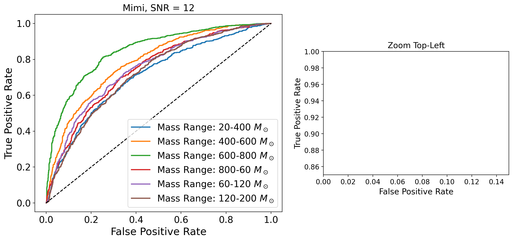

#### Whisper
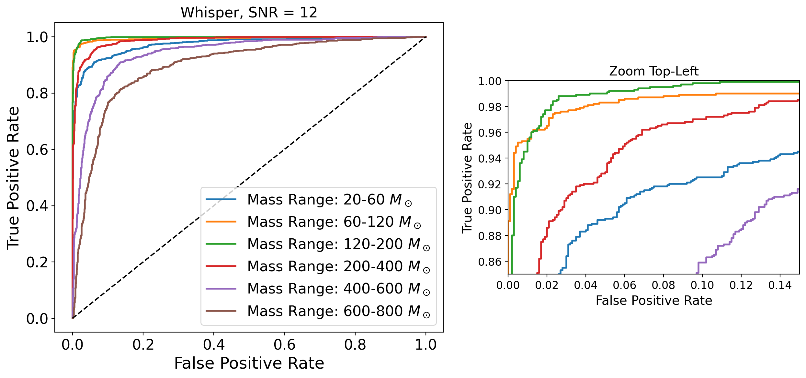

#### AST
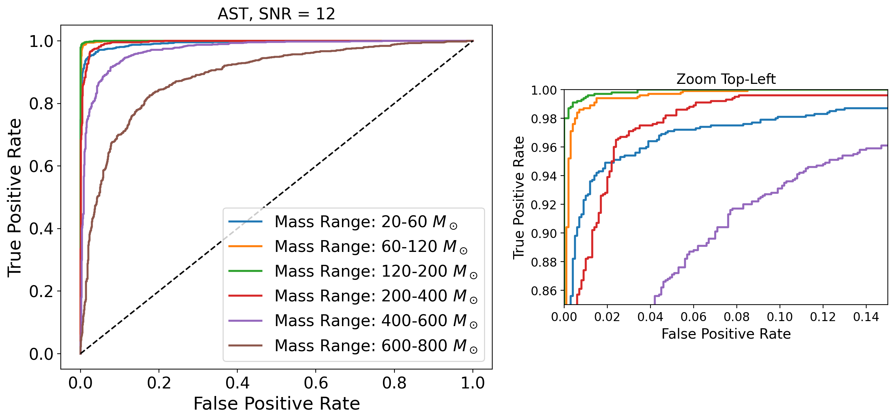

#### Hubert
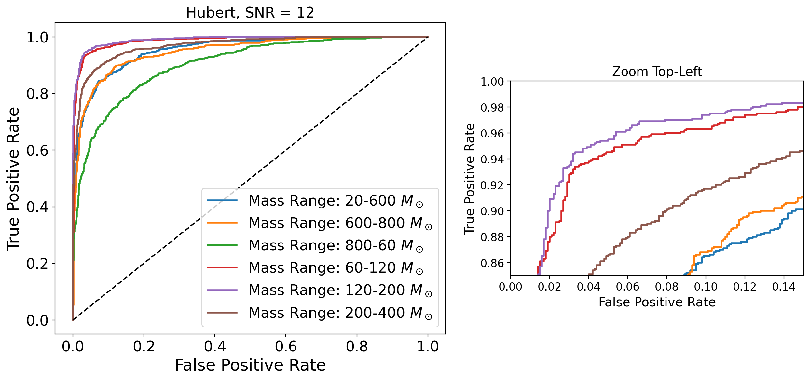

#### Wav2Vec2
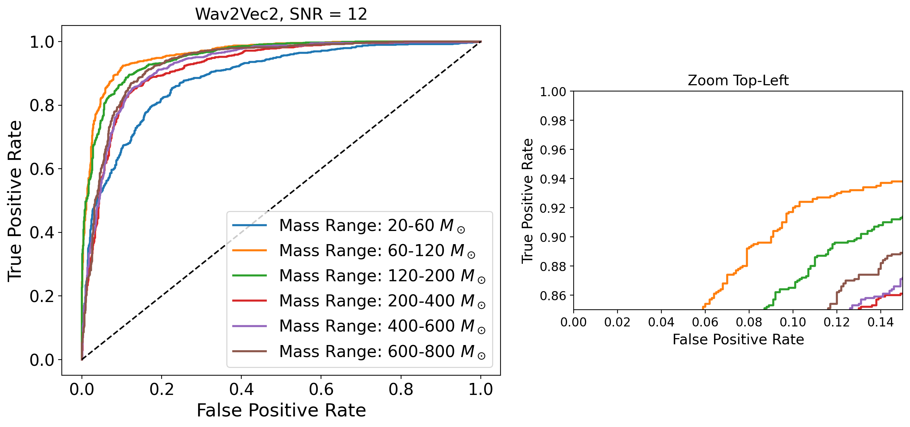

#### Wav2Vec2-Bert
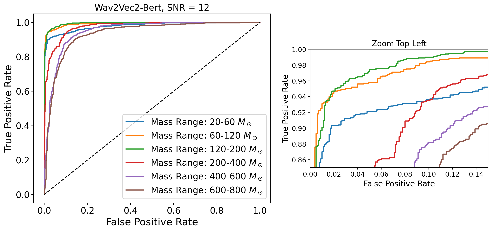

#### Wav2Vec2-XLSR
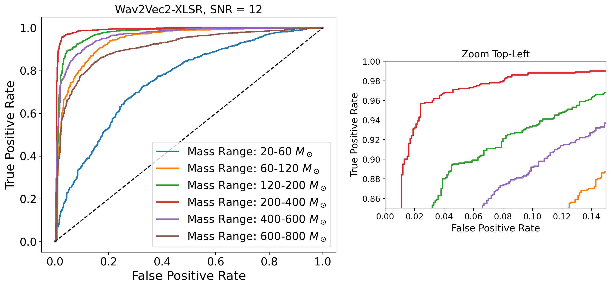

### 5.2 Sorting by Masses

#### $20 - 60 M_\odot$
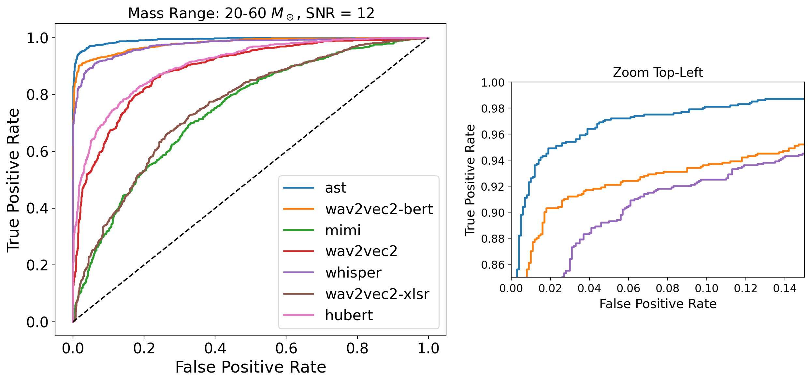

#### $60 - 120 M_\odot$
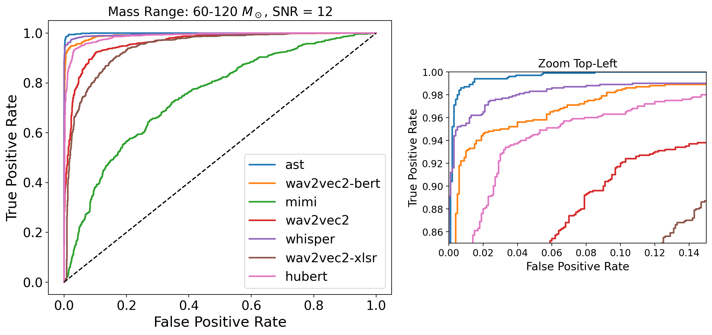

#### $120 - 200 M_\odot$
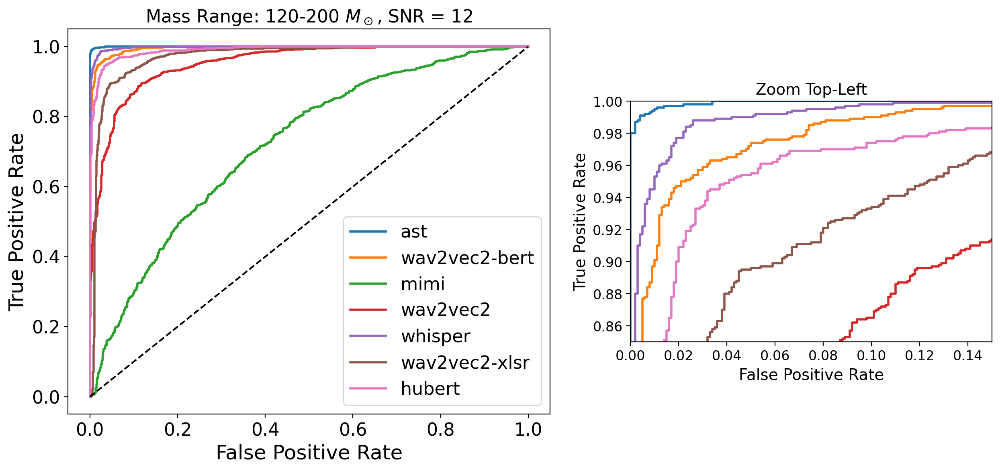

#### $200 - 400 M_\odot$
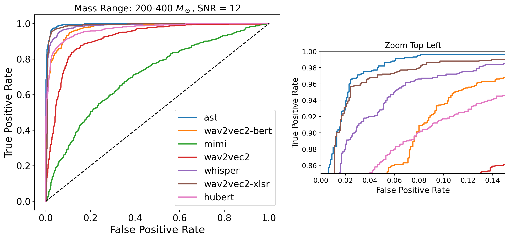

#### $400 - 600 M_\odot$
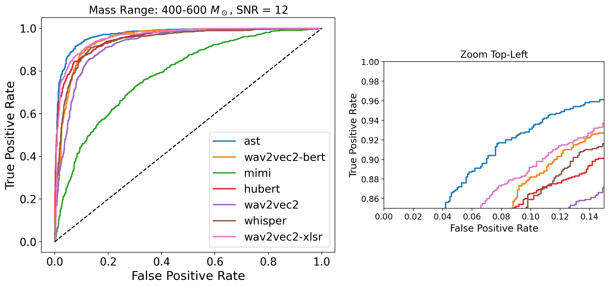

#### $600 - 800 M_\odot$
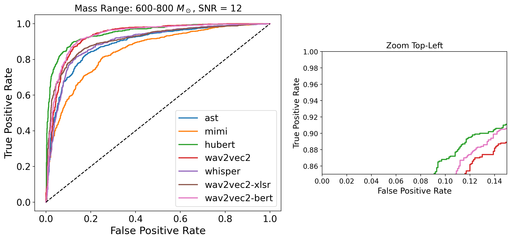

### 5.3 AUROC Table

| Model           | 20–60 | 60–120 | 120–200 | 200–400 | 400–600 | 600–800 |
|-----------------|-------|--------|---------|---------|---------|---------|
| Whisper-Tiny    |  0.9737  |   0.9951  |   0.9976   |   0.9870   |   0.9414   |   0.8958   |
| Wav2Vec2        |  0.8863  |   0.9615  |   0.9529   |   0.9181   |   0.9256   |   0.9319   |
| Wav2Vec2-BERT   |  0.9796  |   0.9919  |   0.9950   |   0.9759   |   0.9500   |   0.9351   |
| Wav2Vec2-XLSR   |  0.7543  |   0.9404  |   0.9711   |   0.9884   |   0.9615   |   0.9093   |
| HuBERT          |  0.9044  |   0.9866  |   0.9901   |   0.9692   |   0.9537   |   **0.9487**   |
| AST             |  **0.9933**  |   **0.9991**  |   **0.9998**   |   **0.9949**   |   **0.9721**   |   0.8876   |
| Mimi            |  0.7409  |   0.7458  |   0.7209   |   0.7081   |   0.7833   |   0.8478   |

### 5.4 Intended Uses

The use case for these models is to rapidly identify GW events in LIGO stream data, but as will be explained below, these models will do quite a bad job at it when using real data.

### 5.5 Limitations and Biases

- Training data is simulated, and so will not contain all real-world effects of the noise / glitches.
- Parameter ranges chosen are essentially "dummy data" ranges; real world will have different mass ratios, spins, SNR, etc.
- In it's current form, these models will get tripped up by glitches the same way the traditional matched filtering pipelines do- they must be trained and evaluated on glitches along with GW signals for a full comparison.

## 6. Critical Analysis
<!-- Answered one or more of the following questions:
What is the impact of this project?
What does it reveal or suggest? 
What is the next step? -->

### 6.1 Impact of Project

- Shows that fine-tuning speech-pretrained audio transformers for astronomical GW data analysis is viable, and has strong potential.
- It has shown me which models are promising and should be further worked on.

### 6.2 What do results reveal?

- AST performs the best for majority of the mass ranges, but this comes at the cost of the highest training time by far.
- It loses it's top spot for the highest mass range - at this point the GW signal has lost so much of it's characteristic "chirp" shape that it will just look like a blip. Since AST is a vision transformer, it seems to be missing the events when it get's to this point, while the others like Hubert have access to the actual "audio" and are able to still pick it up.
- **It means that AST is great when there is a clear morphological difference between events/glitches, but other models might perform better for glitches which look similar in a time-frequency space.**

### 6.3 Next Steps

- Add glitches and compare all of the models.
- Instead of a binary classification, it will become a multi-class labeling problem.
- **Hypothesis: Hubert will perform better for high mass GW events along with glitches that look similar to that (small blip-like shapes).**

## 7. Documentation & Resource Links
<!-- • Repo & ReadMe (3 pts): Setup instructions and usage guide are included
• Resource Links (2 pts): Relevant papers and code bases are cited -->

### 7.1 Repository Structure

```py
transformers-for-GW-analysis/
│
├── data/
│ ├── ml4gw_tutorial.ipynb # generate validation dataset
│ ├── DGX_make_eval_datasets.sh # slurm script to run 'generate_eval_datasets.py'
│ └── generate_eval_datasets.py # generate all evaluation datasets
│
├── figures/
│ └── (contains all the figures used in this README.md file)
│
├── src/
│ ├── train.py # contains base ML4GW code which uses model codes from 'model.py' to train and then to evaluate
│ ├── model.py # contains code for all 7 models
│ └── utils.py # contains code for Early Stopper
│
├── logs/
│ └── (will contain .hdf5 files for each mass evaluation run on each model)
│
├── checkpoints/
│ └── (will contain .pt files for each model)
│
├── DGX_train.sh # slurm script to run 'src/train.py'
├── roc_curves.ipynb # notebook where I plotted all of the figures
└── README.md # you are reading this file!
```

### 7.2 Set up instructions

This code is set up to be run on ACCRE ([Link to ACCRE Website](https://www.vanderbilt.edu/accre/)).

You will need to use the singularity container found here: `/data/p_dsi/ligo/gw_container.simg`

The .ipynb files can be run from the visualization portal, and the .py files have associated .sh slurm scripts to run them.

Quick start guide:
- Run all cells of `ml4gw_tutorial.ipynb`
- `sbatch DGX_make_eval_datasets.sh`
- Edit model name inside `DGX_train.sh`
- `sbatch DGX_train.sh`
- Once all the models have been run, run all cells in `roc_curves.ipynb`

### 7.3 References + Resource Links

**AST:**
Gong, Yuan, Yu-An Chung, and James Glass. “AST: Audio Spectrogram Transformer.” arXiv:2104.01778. Preprint, arXiv, July 8, 2021. https://doi.org/10.48550/arXiv.2104.01778.

**Whisper:**
Radford, Alec, Jong Wook Kim, Tao Xu, Greg Brockman, Christine McLeavey, and Ilya Sutskever. “Robust Speech Recognition via Large-Scale Weak Supervision.” arXiv:2212.04356. Preprint, arXiv, December 6, 2022. https://doi.org/10.48550/arXiv.2212.04356.

**Wav2Vec2:**
Baevski, Alexei, Henry Zhou, Abdelrahman Mohamed, and Michael Auli. “Wav2vec 2.0: A Framework for Self-Supervised Learning of Speech Representations.” arXiv:2006.11477. Preprint, arXiv, October 22, 2020. https://doi.org/10.48550/arXiv.2006.11477.

**Wav2Vec2-Bert:**
Chung, Yu-An, Yu Zhang, Wei Han, et al. “W2v-BERT: Combining Contrastive Learning and Masked Language Modeling for Self-Supervised Speech Pre-Training.” arXiv:2108.06209. Preprint, arXiv, September 13, 2021. https://doi.org/10.48550/arXiv.2108.06209.

**Wav2Vec2-XLSR:**
Conneau, Alexis, Alexei Baevski, Ronan Collobert, Abdelrahman Mohamed, and Michael Auli. “Unsupervised Cross-Lingual Representation Learning for Speech Recognition.” arXiv:2006.13979. Preprint, arXiv, December 15, 2020. https://doi.org/10.48550/arXiv.2006.13979.

**Hubert:**
Hsu, Wei-Ning, Benjamin Bolte, Yao-Hung Hubert Tsai, Kushal Lakhotia, Ruslan Salakhutdinov, and Abdelrahman Mohamed. “HuBERT: Self-Supervised Speech Representation Learning by Masked Prediction of Hidden Units.” arXiv:2106.07447. Preprint, arXiv, June 14, 2021. https://doi.org/10.48550/arXiv.2106.07447.

**Mimi:**
Défossez, Alexandre, Laurent Mazaré, Manu Orsini, et al. “Moshi: A Speech-Text Foundation Model for Real-Time Dialogue.” arXiv:2410.00037. Preprint, arXiv, October 2, 2024. https://doi.org/10.48550/arXiv.2410.00037.

**DoRA:**
Liu, Shih-Yang, Chien-Yi Wang, Hongxu Yin, et al. “DoRA: Weight-Decomposed Low-Rank Adaptation.” arXiv:2402.09353. Preprint, arXiv, July 9, 2024. https://doi.org/10.48550/arXiv.2402.09353.